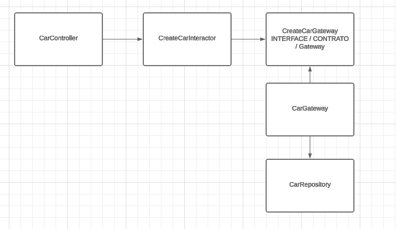
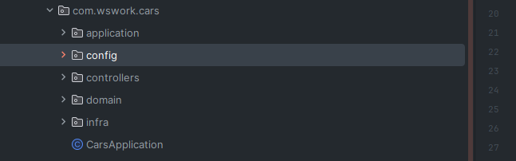
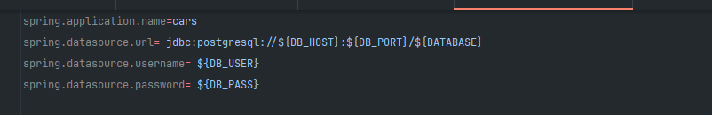

# TESTE JAVA

## Arquitetura do projeto
O padrão utilizado busca criar um sistema com baixo nível de acoplamento, ou seja, a aplicação foi dividida em camadas, buscando ter responsabilidades únicas. 

Exemplo: 


### O quê cada camada significa?
Controller: O controller é responsável por ser a porta de entrada na nossa aplicação, ou seja, ele recebe os dados e redireciona para camadas mais internas. Após os dados serem processados, o controller retorna o resultado para o cliente.

Interactor: O interactor é responsável por processar as regras de negócio da nossa aplicação, fazendo verificações para garantir que as regras de negócio sejam atendidas.

Gateway: O gateway com o repository são responsáveis por fazer a interação com o banco de dados, como obter, criar, atualizar itens do banco de dados. 

## Organização de pastas
Application: A pasta application é onde estão localizados os nossos interactors e contratos de gateway.

Config: A pasta config é onde fazemos as nossas configurações de segurança, exceções e configurações de dependências.

Controllers: A pasta controller é onde estão localizados todos os nossos controllers e dtos de validações.

Domain: A pasta domain é onde estão localizadas as nossas entidades de domínio, exceções e enums.

Infra: A pasta de infra é onde temos os nossos gateways, repositórios e as entidades do banco de dados.



## ROTEAMENTO
O modelo de rotas seguem o seguinte padrão '/api/{model}/:id' ou '/api/{model}/:id'\
Exemplo:
```java
@RestController("/api/car")
@RequestMapping("/api/car")
public class CarController {
}
```

## O que preciso fazer para rodar o projeto?
Primeiramente, você vai precisar ter instalado em sua máquina alguma IDE como o [Intellij](https://lp.jetbrains.com/intellij-idea-features-promo/?msclkid=ba42f174a56a1284115097f64b5a8be6&utm_source=bing&utm_medium=cpc&utm_campaign=AMER_en_BR_IDEA_Branded&utm_term=intellij&utm_content=intellij%20idea) (Intellij oferece opções de JDK e também um ambiente configurado para o Sprint) ou ter instalado o JDK manualmente. Também será necessário ter o PostgreSQL na sua máquina.

Após instalar o PostgresSQL será necessário alterar algumas credenciais no "/resources/application.properties" 


### Como posso executar o projeto?
* Utilizando o JDK, na pasta raiz do projeto será necessário executar os seguintes comandos:
```sh
    mvn clean install
    cd target
    java -jar cars-0.0.1-SNAPSHOT.jar
```
